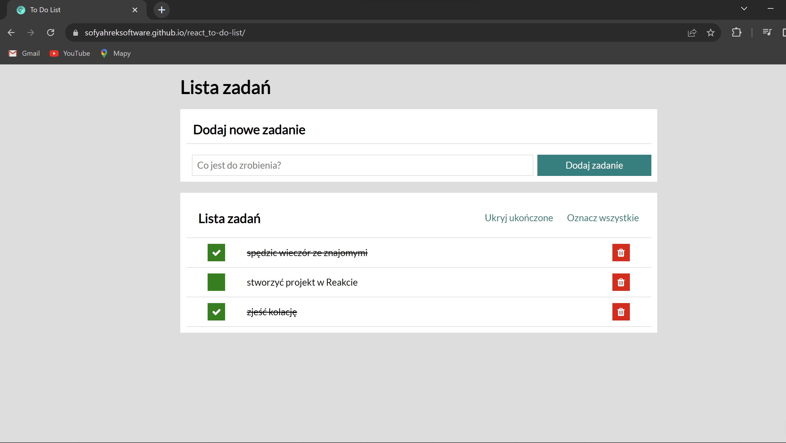

# Tasks List

This project was bootstrapped with [Create React App](https://sofyahreksoftware.github.io/react_to-do-list/).

## Demo

[Link to the main page of Tasks List](https://sofyahreksoftware.github.io/react_to-do-list/)

## Technologies

- **HTML**
- Open Graph Protocol
- Google Fonts

- **CSS**
- Normalize CSS
- CSS Box Model
- BEM convention
- Transition
- Grid
- Flexbox

- **Webpack**
- **Babel**
- **ReactDOM**
- **PostCSS**
- **React**
- styled components
- theme
- custom Hooks (useTasks, useLocalStorage)
- useRef Hook
- useState Hook
- useEffect Hook

- **redux**
- React-Redux
- Redux Toolit

## Description

An application provides making a simple to-do-list. 

## Instruction. How to use an application?

### How to add a task? 

To add a task you need to fill in a form with a task and click a button on the right or at the bottom if you are using it on a mobile device.

### How to remove task? 

To remove a task you need to click a red button on the right side of the task.

### How to mark that the task is done?

To mark that the task is done you need to click a green button on the left side of the task and then it will change to check mark.

### How to save changes in to do list?
 
The application features automatic task saving to **Local Storage**, so there's no need for manual saves.

## Available Scripts

In the project directory, you can run:

### `npm start`

Runs the app in the development mode.\
Open [http://localhost:3000](http://localhost:3000) to view it in your browser.

The page will reload when you make changes.\
You may also see any lint errors in the console.

### `npm run build`

Builds the app for production to the `build` folder.\
It correctly bundles React in production mode and optimizes the build for the best performance.

The build is minified and the filenames include the hashes.\
Your app is ready to be deployed!

See the section about [deployment](https://facebook.github.io/create-react-app/docs/deployment) for more information.

### `npm run eject`

**Note: this is a one-way operation. Once you `eject`, you can't go back!**

If you aren't satisfied with the build tool and configuration choices, you can `eject` at any time. This command will remove the single build dependency from your project.

Instead, it will copy all the configuration files and the transitive dependencies (webpack, Babel, ESLint, etc) right into your project so you have full control over them. All of the commands except `eject` will still work, but they will point to the copied scripts so you can tweak them. At this point you're on your own.

You don't have to ever use `eject`. The curated feature set is suitable for small and middle deployments, and you shouldn't feel obligated to use this feature. However we understand that this tool wouldn't be useful if you couldn't customize it when you are ready for it.
