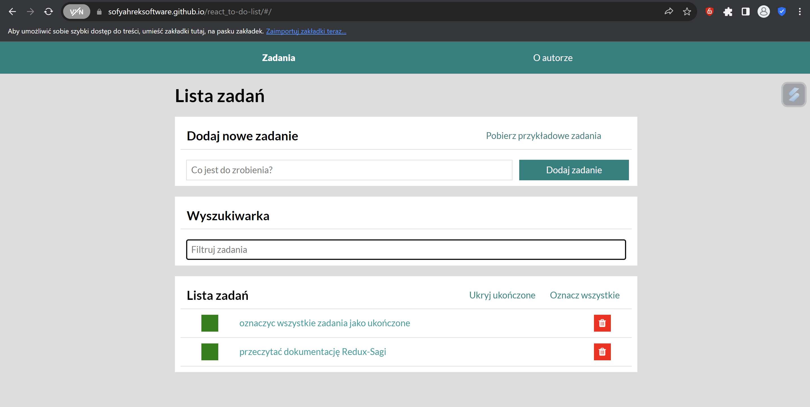
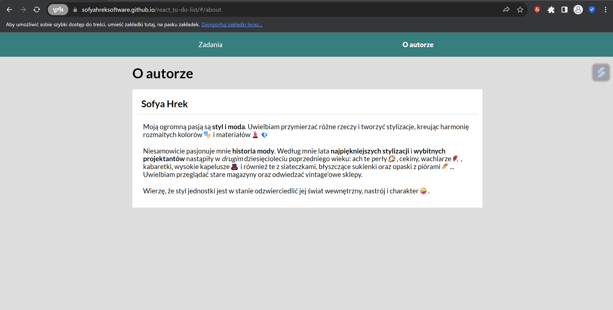
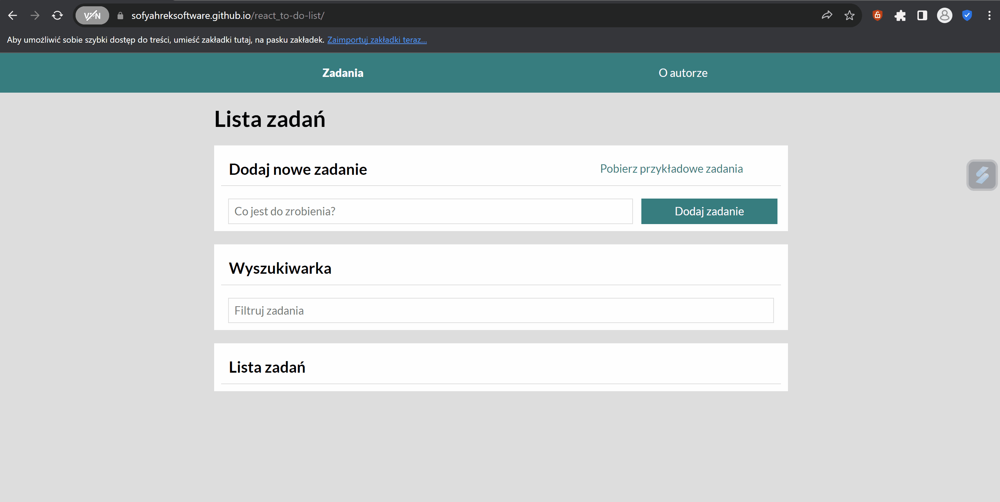
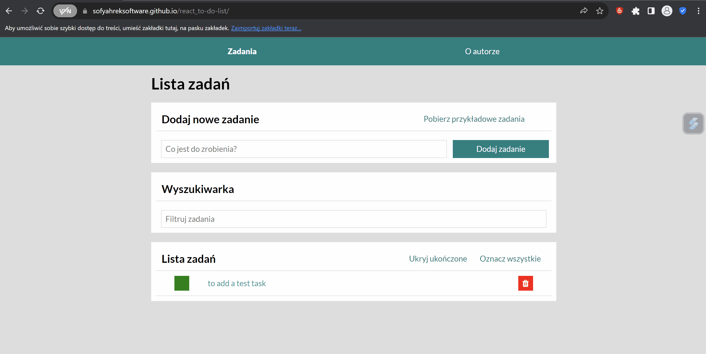
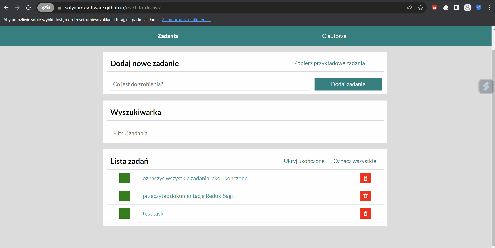
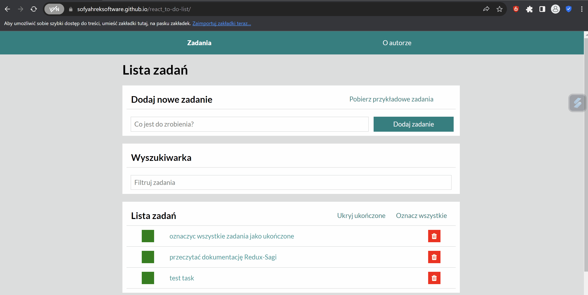
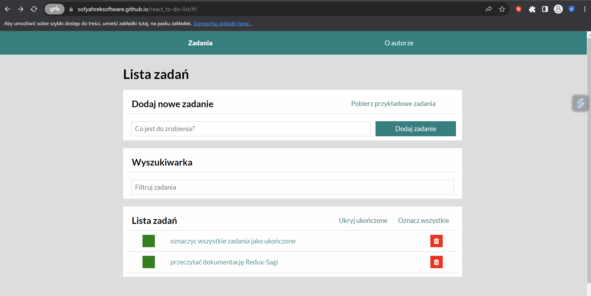
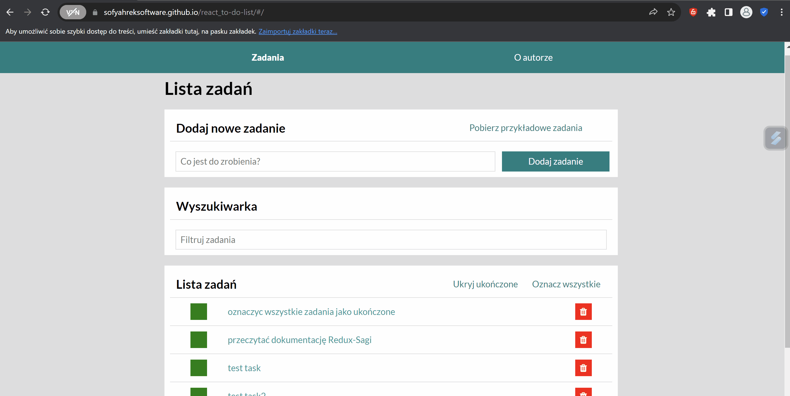
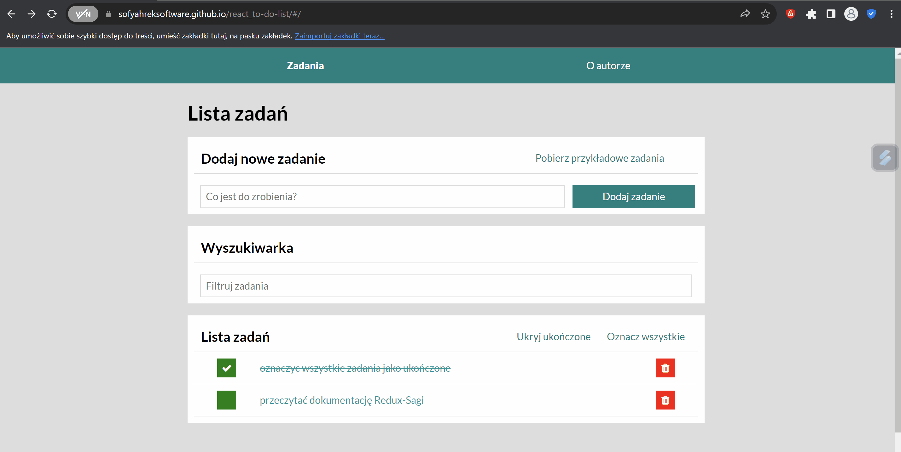

# Tasks List

This project was bootstrapped with [Create React App](https://sofyahreksoftware.github.io/react_to-do-list/).

## Demo

[Link to the main page of Tasks List](https://sofyahreksoftware.github.io/react_to-do-list/)

## Technologies

### HTML

- HTML5: Leveraging the latest HTML standards for structure and semantics.
- Accessibility: Implementing ARIA roles and semantic HTML to enhance accessibility.
- Open Graph Protocol
- Google Fonts

### JavaScript & Frameworks

_Core Technologies_

- **React**: The primary library for building the user interface, emphasizing reusable components.
- **ReactDOM**: Manages rendering of React components in the DOM.
- **Webpack**
- **Babel**
- **ReactDOM**
- **PostCSS**

_State Management_

- store subscription
- **Redux Toolkit**
- createSlice
- configureStore
- **React-Redux**
- Provider
- useSelector
- useDispatch

_Utilities and Hooks_

- Axios
- Error Handling
- nanoid
- custom Hooks (useQueryParameter, usereplaceQueryParameter)
- useRef Hook
- useState Hook
- URLSearchParams

_Routing_

- **react-router-dom**
- Hashrouter
- Route
- Link, Navlink
- route params
- useNavigate, useParams, useLocation

_Asynchronous Logic_

- **Redux Saga**
- Generator Functions
- efects(takeEvery, takeLatest, delay, select, put, call, fork, all)
- Middleware

_Styling and CSS Techniques_

- Normalize CSS
- CSS Box Model
- CSS Transitions: Enhancing user experience with smooth transitions.
- CSS Grid & Flexbox: Employing modern layout systems for responsive designs.
- **Styled Components**
- Theming

## Description

The application consists of two subpages: _tasks_ and _about the author_.

The tasks subpage provides _making a to-do-list_ with _adding_, _deleting_ and _marking tasks as complered_.
Additionally, it is possible to **download sample tasks**.
Also to manage them conveniently and easily you can **use the task search engine** and **go to the separate subpage of each of the added ones**.
Yo can **hide done tasks** and **mark all of them as completed** by clicking the buttons.

## Instruction. How to use the application?

### How to add a task?

Fill in a form with a task content and click a button on the right side.

### How to mark that the task as done?

Click a green button on the left side of the task.

### How to remove task?

Click a red button on the right side of the task.

### How to mark that all tasks are done by clicking one button?

Click the button on the top right corner of 3rd section.

### How to hide & show done tasks?

Click the first button on the top of 3rd section.

### How to fetch example tasks?

Click the button on the top right corner of 1th section. Wait for about 2-3 seconds while loading.

### How to go to subpage with details of a given task?

Click on the task whose details you want to display.

### How to search a given task in a task list?

There are 2 options how ta search a given task.

You can use an input in the second section. Enter a word or a full sentence in the box that the task you are searching for may contain. The tasks will be filtered by a query.
Use a path. Write ?search=searching sentence/word at the end of it.

### How to go to about subpage?

Use the navigation at the top of the page - go to the "About" link.

### How to save changes in to-do list?

The application features automatic task saving to **Local Storage**, so there's no need for manual saves.

## Available Scripts

In the project directory, you can run:

### `npm start`

Runs the app in the development mode.\
Open [http://localhost:3000](http://localhost:3000) to view it in your browser.

The page will reload when you make changes.\
You may also see any lint errors in the console.

### `npm run build`

Builds the app for production to the `build` folder.\
It correctly bundles React in production mode and optimizes the build for the best performance.

The build is minified and the filenames include the hashes.\
Your app is ready to be deployed!

See the section about [deployment](https://facebook.github.io/create-react-app/docs/deployment) for more information.

### `npm run eject`

**Note: this is a one-way operation. Once you `eject`, you can't go back!**

If you aren't satisfied with the build tool and configuration choices, you can `eject` at any time. This command will remove the single build dependency from your project.

Instead, it will copy all the configuration files and the transitive dependencies (webpack, Babel, ESLint, etc) right into your project so you have full control over them. All of the commands except `eject` will still work, but they will point to the copied scripts so you can tweak them. At this point you're on your own.

You don't have to ever use `eject`. The curated feature set is suitable for small and middle deployments, and you shouldn't feel obligated to use this feature. However we understand that this tool wouldn't be useful if you couldn't customize it when you are ready for it.
